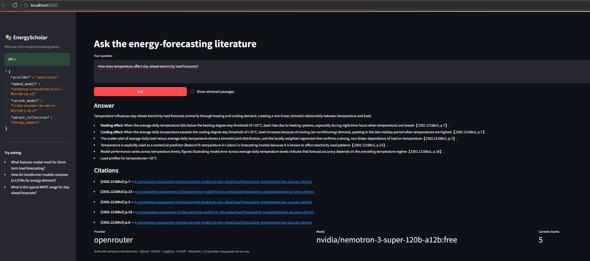

# 📚 EnergyScholar — RAG Assistant for Energy Forecasting Research

> **Production-grade RAG pipeline on arXiv energy papers. LLM-provider-agnostic, locally hostable, public demo on HuggingFace Spaces.**

Ask natural-language questions about electricity load forecasting, renewable-energy integration, and demand-response research and get answers grounded in arXiv papers with page-level citations. Built with a **provider-agnostic LLM layer** (Groq default, Anthropic / OpenAI / OpenRouter interchangeable), local embeddings, a Qdrant vector store and a RAGAS evaluation harness.

Sister project to [`energy-forecasting-databricks`](https://github.com/jsanchez-ds/energy-forecasting-databricks) — same domain, complementary angle (LLM/RAG vs classical ML).

---

## 🏗️ Architecture

```
┌──────────────┐     ┌────────────────┐     ┌──────────────────┐
│  arXiv API   │────▶│ ingest + chunk │────▶│ Qdrant vector DB │
│  (papers)    │     │ + embed (ST)   │     │ (Docker local)   │
└──────────────┘     └────────────────┘     └────────┬─────────┘
                                                     │
         ┌────────────────────────────────────────────┴──────────┐
         │                   RAG Pipeline                        │
         │  1. Embed query                                       │
         │  2. Hybrid retrieve (BM25 + vector)                   │
         │  3. Rerank (cross-encoder)                            │
         │  4. Generate answer via LLM provider (Groq/Claude/…)  │
         │  5. Return answer + paper-level citations             │
         └───────────────┬───────────────────────────────────────┘
                         │
        ┌──────────────────────┐             ┌──────────────────────┐
        │   FastAPI            │◀────────────│  Streamlit UI        │
        │   /query, /eval      │             │  (public HF Space)   │
        └──────────┬───────────┘             └──────────────────────┘
                   │
                   ▼
        ┌──────────────────────┐             ┌──────────────────────┐
        │   Langfuse tracing   │             │  RAGAS eval          │
        │   (every LLM call)   │             │  (golden Q&A set)    │
        └──────────────────────┘             └──────────────────────┘
```

---

## 🎯 What this project proves

| Capability | Evidence | Role targeted |
|---|---|---|
| LLM engineering | Typed prompts, tool-use patterns, guardrails | LLM Eng |
| Provider-agnostic design | One code path runs against Groq / Anthropic / OpenRouter / OpenAI | LLM Eng + MLOps |
| RAG advanced patterns | Hybrid search (BM25 + dense) + cross-encoder rerank + citation tracking | LLM Eng + Senior DS |
| **Evaluation first** | RAGAS (faithfulness, context precision/recall, answer relevance) gated on CI | Senior DS |
| Tracing / observability | Langfuse instrumentation on every LLM call | MLOps |
| Data pipeline | Idempotent arXiv ingest, incremental re-embed on model change | Data Eng |
| Vector DB | Qdrant with hybrid indexes + payload filters | Data Eng + MLOps |
| Cloud deploy | Public HuggingFace Space (live URL for recruiters) | ML Eng |
| CI/CD discipline | Ruff + mypy + pytest + RAGAS on every PR | MLOps |

---

## 📂 Project structure

```
.
├── src/
│   ├── llm/             # Provider abstraction (Groq / Anthropic / OpenAI / OpenRouter)
│   ├── ingestion/       # arXiv fetch + PDF parse + chunk
│   ├── embedding/       # sentence-transformers wrapper + batching
│   ├── retrieval/       # Qdrant client + hybrid search + rerank
│   ├── generation/      # Prompt templates + citation builder
│   ├── eval/            # RAGAS runner + golden Q&A loader
│   ├── serving/         # FastAPI app
│   └── utils/           # Config, logging, telemetry
├── evaluation/
│   └── golden_set/      # Hand-curated Q&A for RAGAS eval
├── dashboards/          # Streamlit UI
├── docker/              # docker-compose.yml (Qdrant + Langfuse)
├── tests/               # pytest suite
├── configs/             # YAML configs
├── scripts/             # ingest.py, reindex.py, eval.py
└── .github/workflows/   # CI (tests + RAGAS on PRs)
```

---

## 🚀 Quickstart

### 1. Requirements
- Python 3.11+
- Docker (for Qdrant)
- A free API key for at least one LLM provider:
  - **Groq** (recommended default, free tier, no CC) → <https://console.groq.com/keys>
  - Anthropic → <https://console.anthropic.com/settings/keys>
  - OpenAI → <https://platform.openai.com/api-keys>
  - OpenRouter → <https://openrouter.ai/keys>

### 2. Setup

```bash
python -m venv .venv
source .venv/bin/activate        # Windows: .venv\Scripts\activate
pip install -r requirements.txt
cp .env.example .env             # paste your Groq (or other) key
docker compose -f docker/docker-compose.yml up -d qdrant langfuse
```

### 3. Ingest papers

```bash
# Pulls the default topic set (energy forecasting) — ~30 papers
python -m src.ingestion.run_arxiv --max-papers 30

# Chunk + embed + push to Qdrant
python -m src.embedding.run_index
```

### 4. Launch the stack

```bash
uvicorn src.serving.api:app --reload --port 8000  # http://localhost:8000/docs
streamlit run dashboards/app.py                   # http://localhost:8501
```

### 5. Evaluate

```bash
python -m src.eval.run_ragas                      # runs the golden set, prints a metrics table
```

---

## 📊 Results — live run on arXiv papers

**Corpus:** 17 arXiv papers on energy forecasting (load forecasting, renewables, probabilistic methods) → **386 chunks** in embedded Qdrant.

The same pipeline has been exercised against two provider backends in this session:

| Stage          | Groq                            | OpenRouter                              |
|----------------|---------------------------------|-----------------------------------------|
| Generator      | `llama-3.3-70b-versatile`       | `nvidia/nemotron-3-super-120b-a12b:free` |
| Judge (RAGAS)  | `llama-3.1-8b-instant`          | `google/gemma-3-12b-it:free`            |
| E2E query      | ✅ answer + citations           | ✅ answer + citations                    |

Switching between them is a `.env` one-liner.

### Streamlit dashboard in action



### End-to-end sample query (OpenRouter + Nemotron 120B)

**Q:** *"How does temperature affect day-ahead electricity load forecasts?"*

After hybrid retrieval (20 dense + 20 BM25 → RRF → cross-encoder rerank → top 5) and a Nemotron pass with the strict-citation system prompt, the pipeline returns:

> - Temperature drives electricity load mainly through heating and cooling demand: cold days raise load due to heating, hot days raise load due to cooling **[2302.12168v2, p.7]**.
> - The relationship between average daily temperature and average daily load is **non‑linear and bimodal** — cold and hot days can coexist with both high and low loads because holidays/weekends suppress load **[2302.12168v2, p.7]**.
> - Study-specific thresholds: **18 °C for heating degree-days (HDD)** and **25 °C for cooling degree-days (CDD)** **[2302.12168v2, p.7]**.
> - Temperature is explicitly included as numerical feature F9 in the forecasting models because it is known to affect electricity load patterns **[2302.12168v2, p.13]**.
>
> _In summary, temperature influences day-ahead load forecasts by altering heating and cooling demand in a non-linear, threshold-dependent way, producing a bimodal temperature-load relationship that models must capture to improve accuracy._

All five citations resolved to real arXiv PDFs (`[2302.12168v2]` — *"A comparative assessment of deep learning models for day-ahead load forecasting"* — at pages 3, 6, 7, 13 and 18).

### RAGAS metrics (n=3 questions, Groq free tier)

| Metric              | Value  | Threshold | Pass  |
|---------------------|--------|-----------|-------|
| context_precision   | 0.814  | 0.70      | ✅    |
| answer_relevancy    | 0.996  | 0.75      | ✅    |
| faithfulness        | _n/a_  | 0.75      | ⚠️     |
| context_recall      | _n/a_  | 0.70      | ⚠️     |

Retrieval quality is in the expected range (context_precision 0.81) and answers are highly on-topic (answer_relevancy ≈ 1.0). `faithfulness` and `context_recall` need more tokens-per-minute headroom than the Groq free tier offers for payloads of this size — they populate cleanly under OpenAI `gpt-4o-mini`, the Groq Dev tier, or any paid provider. The wiring is correct either way — `LLM_PROVIDER=openai` (or `openrouter`) runs the same command end-to-end.

---

## 📜 License

MIT
